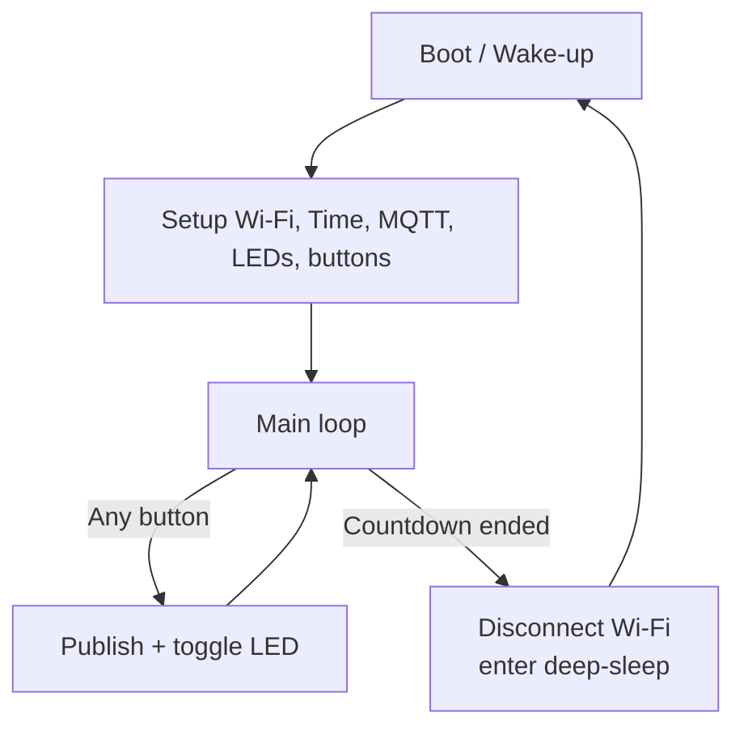

Vores ide om, hvordan kodeflowet kommer til at være for anordningen, når den kører.

### Udfordringer:
* Documentationen og guides på synokronisering af RTC uret via NTP var meget forvirende, og gjorde det svært at forstå hvordan og hvornår synkroniseringen forgår.

### Diskusioner:
* Hvor lang tid skal timeren være til DeepSleep, for at spare strøm? Det kommer meget an på gennemsnittet af kunder der går forbi standeren, da enheden skal opsætte og konfigurer følgende hver gang:
  * WiFi/RF modulet
  * Finde og forbinde til AP
  * Indstille WiFi kannalen
  * Så tildelt en IP addresse
  * Synkroniserer RTC uret
  * Forbinde til MQTT brokeren hver gang

  Målinger af brug af strøm under standard kørsel og DeepSleep burde også fortages, for at konkluderer den optimale timer.