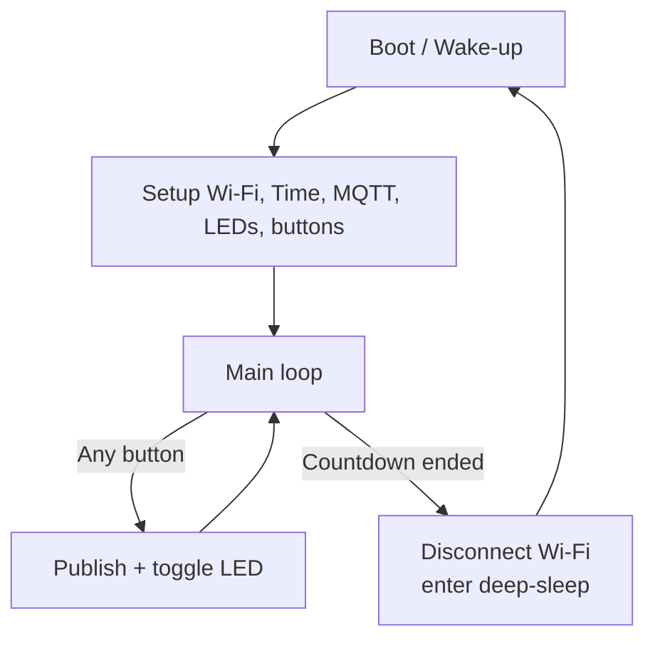

Vores ide om, hvordan kodeflowet kommer til at være for anordningen, når den kører.

```mermaid
flowchart TD
    Boot[Boot / Wake-up] --> Setup[Setup Wi-Fi, Time, MQTT, LEDs, buttons]
    Setup --> Loop[Main loop]
    Loop -->|Any button| Press[Publish + toggle LED]
    Press --> Loop
    Loop -->|Countdown ended| Sleep[Disconnect Wi-Fi<br/>enter deep-sleep]
    Sleep --> Boot
```

